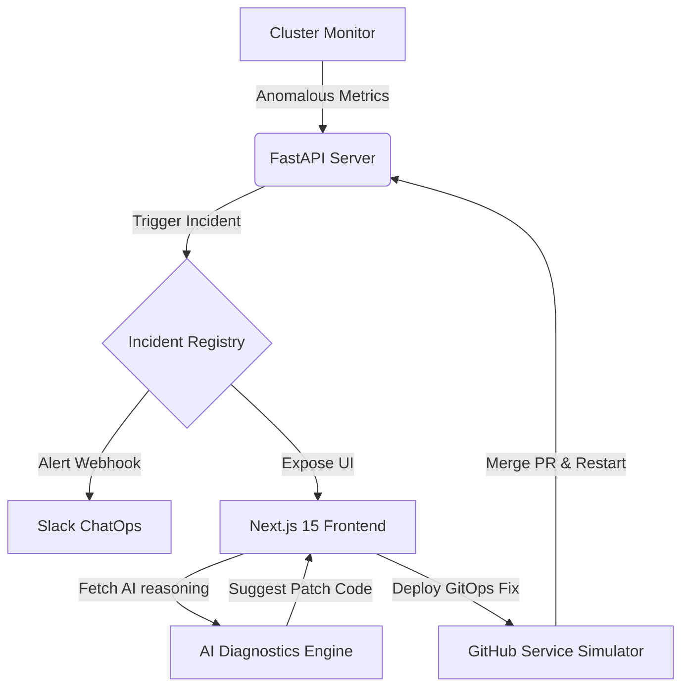

# Sentinel AI Architecture Document

This document outlines the core architecture of Sentinel AI.

## Core Workflows

1. **Failure Simulation**:
   - The user triggers a service outage on the React frontend.
   - The API registers a status transition (e.g., degraded or down) and inserts an incident entry.
   - The metrics engine begins injecting dynamic noise (high memory limits, connection failures, elevated timeouts) onto the metrics feed.

2. **Self-Healing Loop**:
   - The user visits the Incident details screen, which queries the AI Diagnostic Engine.
   - The engine provides structural logs showing where/why the container failed.
   - The user triggers "Deploy Remediation PR".
   - The system patches the simulated file, merges a GitHub PR, and triggers service recovery.
   - Metrics return to baseline values.
